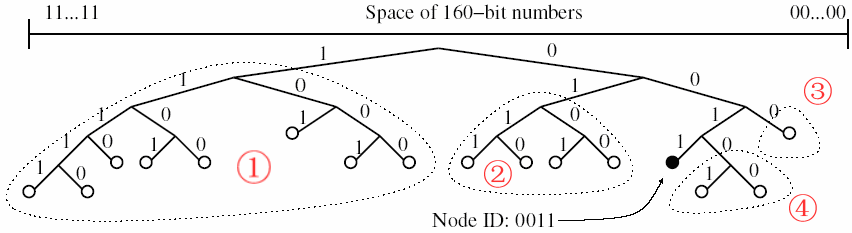
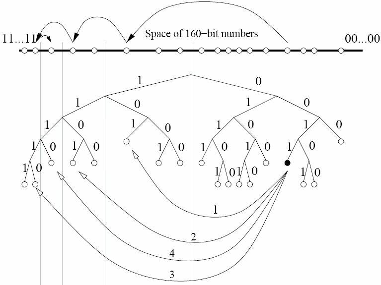
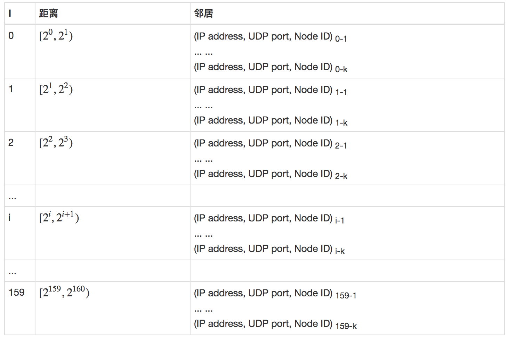
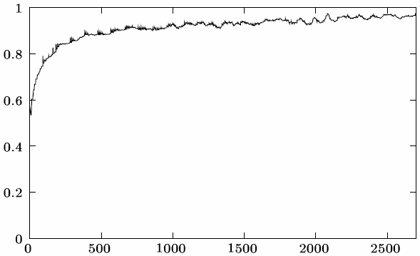
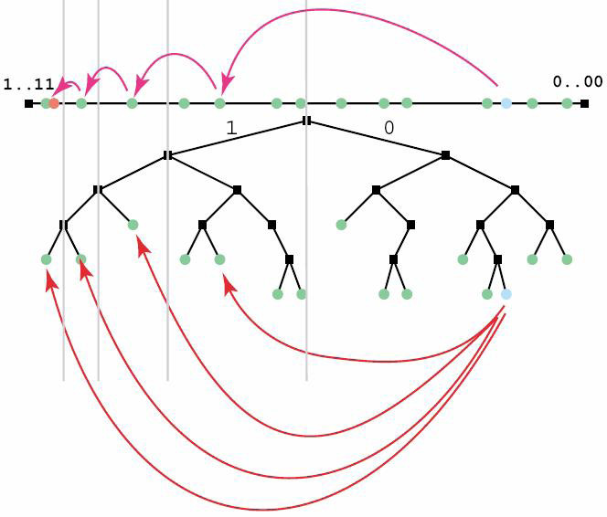
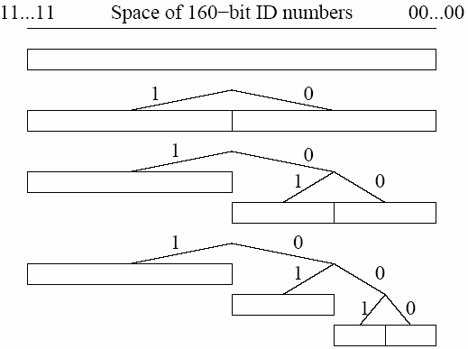
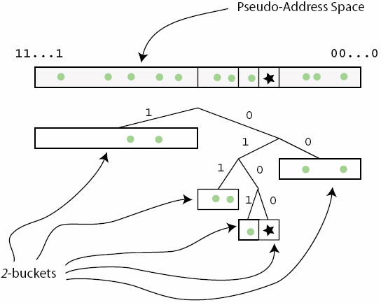

#Kademila原理简介
##1.前言
Kademlia 协议（以下简称 Kad）是美国纽约大学的 P. Maymounkov 和 D. Mazieres 在2002年发布的一项研究结果 Kademlia: A peerto-peer information system based on the XOR metric。

简单的说，Kad 是一种分布式哈希表（DHT）技术，不过和其他 DHT 实现技术比较，如 Chord、CAN、Pastry 等，Kad 通过独特的以异或算法（XOR）为距离度量基础，建立了一种全新的 DHT 拓扑结构，相比于其他算法，大大提高了路由查询速度。

在2005年5月著名的 BiTtorrent 在 4.1.0 版实现基于 Kademlia 协议的 DHT 技术后，很快国内的 BitComet 和 BitSpirit 也实现了和 BitTorrent 兼容的 DHT 技术，实现 trackerless下载方式。

另外，emule 中也很早就实现了基于 Kademlia 类似的技术（BT 中叫 DHT，emule 中也叫 Kad，注意和本文简称的 Kad 区别），和 BT 软件使用的 Kad 技术的区别在于 key、value 和 node ID 的计算方法不同。

##2.节点状态
在 Kad 网络中，所有节点都被当作一颗二叉树的叶子，并且每一个节点的位置都由其 ID 值的最短前缀唯一的确定。

对于任意一个节点，都可以把这颗二叉树分解为一系列连续的，不包含自己的子树。最高层的子树，由整颗树不包含自己的树的另一半组成；下一层子树由剩下部分不包含自己的一半组成；依此类推，直到分割完整颗树。图 1 就展示了节点0011如何进行子树的划分：



虚线包含的部分就是各子树，由上到下各层的前缀分别为0，01，000，0010。

Kad 协议确保每个节点知道其各子树的至少一个节点，只要这些子树非空。在这个前提下，每个节点都可以通过ID值来找到任何一个节点。这个路由的过程是通过所谓的 XOR（异或）距离得到的。

图 2 就演示了节点0011如何通过连续查询来找到节点1110的。节点0011通过在逐步底层的子树间不断学习并查询最佳节点，获得了越来越接近的节点，最终收敛到目标节点上。



需要说明的是，只有第一步查询的节点101，是节点0011已经知道的，后面各步查询的节点，都是由上一步查询返回的更接近目标的节点，这是一个递归操作的过程。

##3. 节点间距离
Kad 网络中每个节点都有一个 160 bit 的 ID 值作为标志符，Key 也是一个 160 bit 的标志符，每一个加入 Kad 网络的计算机都会在 160 bit 的 key 空间被分配一个节点 ID（node ID）值（可以认为 ID 是随机产生的）， <key,value> 对的数据就存放在 ID 值“最”接近 key 值的节点上。

判断两个节点 x,y 的距离远近是基于数学上的异或的二进制运算， d(x,y)=x⊕y ，既对应位相同时结果为0，不同时结果为1。例如：

```
    010101
XOR 110001
----------
    100100
```
则这两个节点的距离为 32+4=36 。显然，高位上数值的差异对结果的影响更大。

对于异或操作，有如下一些数学性质：
```
d(x,x)=0
d(x,y)>0,ifx≠y
∀x,y:d(x,y)=d(y,x)
d(x,y)+d(y,z)≥d(x,z)
d(x,y)⊕d(y,z)=d(x,z)
∀a≥0,b≥0,a+b≥a⊕b
```
正如 Chord 的顺时针旋转的度量一样，异或操作也是单向性的。对于任意给定的节点 x 和距离 Δ≥0 ，总会存在一个精确的节点 y ，使得 d(x,y)=Δ 。另外，单向性也确保了对于同一个 key 值的所有查询都会逐步收敛到同一个路径上，而不管查询的起始节点位置如何。这样，只要沿着查询路径上的节点都缓存这个 <key,value> 对，就可以减轻存放热门 key 值节点的压力，同时也能够加快查询响应速度。

##4. K 桶
Kad 的路由表是通过一些称之为 K 桶的表格构造起来的。这有点类似 Tapestry 技术，其路由表也是通过类似的方法构造的。

对每一个 0≤i≤160 ，每个节点都保存有一些和自己距离范围在区间 [2i,2i+1) 内的一些节点信息，这些信息由一些 (IP address,UDP port,Node ID) 数据列表构成（Kad 网络是靠 UDP 协议交换信息的）。每一个这样的列表都称之为一个 K 桶，并且每个 K 桶内部信息存放位置是根据上次看到的时间顺序排列，最近（ least-recently）看到的放在头部，最后（most-recently）看到的放在尾部。每个桶都有不超过 k 个的数据项。

一个节点的全部 K 桶列表如表 1 所示：



不过通常来说当 i 值很小时，K 桶通常是空的（也就是说没有足够多的节点，比如当 i = 0 时，就最多可能只有1项）；而当 i 值很大时，其对应 K 桶的项数又很可能会超过 k 个（当然，覆盖距离范围越广，存在较多节点的可能性也就越大），这里 k 是为平衡系统性能和网络负载而设置的一个常数，但必须是偶数，比如 k = 20。在 BitTorrent 的实现中，取值为 k = 8。

由于每个 K 桶覆盖距离的范围呈指数关系增长，这就形成了离自己近的节点的信息多，离自己远的节点的信息少，从而可以保证路由查询过程是收敛。因为是用指数方式划分区间，经过证明，对于一个有 N 个节点的 Kad 网络，最多只需要经过 logN 步查询，就可以准确定位到目标节点。这个特性和 Chord 网络上节点的 finger table 划分距离空间的原理类似。

当节点 x 收到一个 PRC 消息时，发送者 y 的 IP 地址就被用来更新对应的 K 桶，具体步骤如下：
-  计算自己和发送者的距离： d(x,y)=x⊕y ，注意：x 和 y 是 ID 值，不是 IP 地址
- 通过距离 d 选择对应的 K 桶进行更新操作
- 如果 y 的 IP 地址已经存在于这个 K 桶中，则把对应项移到该该 K 桶的尾部
- 如果 y 的 IP 地址没有记录在该 K 桶中
    - 如果该 K 桶的记录项小于 k 个，则直接把 y 的 (IP address, UDP port, Node ID) 信息插入队列尾部
    - 如果该 K 桶的记录项大于 k 个，则选择头部的记录项（假如是节点 z）进行 RPC_PING 操作
        - 如果 z 没有响应，则从 K 桶中移除 z 的信息，并把 y 的信息插入队列尾部
        - 如果 z 有响应，则把 z 的信息移到队列尾部，同时忽略 y 的信息

K 桶的更新机制非常高效的实现了一种把最近看到的节点更新的策略，除非在线节点一直未从 K 桶中移出过。也就是说在线时间长的节点具有较高的可能性继续保留在 K 桶列表中。

采用这种机制是基于对 Gnutella 网络上大量用户行为习惯的研究结果，既节点的失效概率和在线时长成反比关系，如图 3（横坐标为分钟，纵坐标为概率）：



可以明显看出，用户在线时间越长，他在下一时段继续在线的可能性就越高。

所以，通过把在线时间长的节点留在 K 桶里，Kad 就明显增加 K 桶中的节点在下一时间段仍然在线的概率，这对应 Kad 网络的稳定性和减少网络维护成本（不需要频繁构建节点的路由表）带来很大好处。

这种机制的另一个好处是能在一定程度上防御 DOS 攻击，因为只有当老节点失效后，Kad 才会更新 K 桶的信息，这就避免了通过新节点的加入来泛洪路由信息。

为了防止 K 桶老化，所有在一定时间之内无更新操作的 K 桶，都会分别从自己的 K 桶中随机选择一些节点执行 RPC_PING 操作。

上述这些 K 桶机制使 Kad 缓和了流量瓶颈（所有节点不会同时进行大量的更新操作），同时也能对节点的失效进行迅速响应。

##5. Kademlia 协议操作类型
Kademlia 协议包括四种远程 RPC 操作：PING、STORE、FIND_NODE、FIND_VALUE。

1. PING 操作的作用是探测一个节点，用以判断其是否仍然在线。

2. STORE 操作的作用是通知一个节点存储一个 <key,value> 对，以便以后查询需要。

3. FIND_NODE 操作使用一个 160 bit 的 ID 作为参数。本操作的接受者返回它所知道的更接近目标 ID 的 K 个节点的 (IP address, UDP port, Node ID) 信息。

   这些节点的信息可以是从一个单独的 K 桶获得，也可以从多个 K 桶获得（如果最接近目标 ID 的 K 桶未满）。不管是哪种情况，接受者都将返回 K 个节点的信息给操作发起者。但如果接受者所有 K 桶的节点信息加起来也没有 K 个，则它会返回全部节点的信息给发起者。

4. FIND_VALUE 操作和 FIND_NODE 操作类似，不同的是它只需要返回一个节点的 (IP address, UDP port, Node ID) 信息。如果本操作的接受者收到同一个 key 的 STORE 操作，则会直接返回存储的 value 值。

   注：在 Kad 网络中，系统存储的数据以 <key,value> 对形式存放。根据笔者的分析，在 BitSpirit 的 DHT 实现中，其 key 值为 torrent 文件的 info_hash 串，其 value 值则和 torrent 文件有密切关系。   

为了防止伪造地址，在所有 RPC 操作中，接受者都需要响应一个随机的 160 bit 的 ID 值。另外，为了确信发送者的网络地址，PING 操作还可以附带在接受者的 RPC 回复信息中。

###6. 路由查询机制
Kad 技术的最大特点之一就是能够提供快速的节点查找机制，并且还可以通过参数进行查找速度的调节。

假如节点 x 要查找 ID 值为 t 的节点，Kad 按照如下递归操作步骤进行路由查找：
1. 计算到 t 的距离： d(x,y)=x⊕y
2. 从 x 的第 [logd] 个 K 桶中取出 α 个节点的信息（“[”“]”是取整符号），同时进行 FIND_NODE 操作。如果这个 K 桶中的信息少于 α 个，则从附近多个桶中选择距离最接近 d 的总共 α 个节点。
3. 对接受到查询操作的每个节点，如果发现自己就是 t，则回答自己是最接近 t 的；否则测量自己和 t 的距离，并从自己对应的 K 桶中选择 α 个节点的信息给 x。
4. X 对新接受到的每个节点都再次执行 FIND_NODE 操作，此过程不断重复执行，直到每一个分支都有节点响应自己是最接近 t 的。
5. 通过上述查找操作，x 得到了 k 个最接近 t 的节点信息。
注意：这里用“最接近”这个说法，是因为 ID 值为 t 的节点不一定存在网络中，也就是说 t 没有分配给任何一台电脑。

这里 α 也是为系统优化而设立的一个参数，就像 K 一样。在 BitTorrent 实现中，取值为 α=3 。

当 α=1 时，查询过程就类似于 Chord 的逐跳查询过程，如图 4。



整个路由查询过程是递归操作的，其过程可用数学公式表示为：
```
n0=x (即查询操作的发起者)

N1=find ⎯noden0(t)

N2=find ⎯noden1(t)

... ...

Nl=find ⎯nodenl−1(t)
```
这个递归过程一直持续到 Nl=t ，或者 Nl 的路由表中没有任何关于 t 的信息，即查询失败。

由于每次查询都能从更接近 t 的 K 桶中获取信息，这样的机制保证了每一次递归操作都能够至少获得距离减半（或距离减少 1 bit）的效果，从而保证整个查询过程的收敛速度为 O(logN) ，这里 N 为网络全部节点的数量。

当节点 x 要查询 <key,value> 对时，和查找节点的操作类似，x 选择 k 个 ID 值最接近 key 值的节点，执行 FIND_VALUE 操作，并对每一个返回的新节点重复执行 FIND_VALUE 操作，直到某个节点返回 value 值。

一旦 FIND_VALUE 操作成功执行，则 <key,value> 对数据会缓存在没有返回 value 值的最接近的节点上。这样下一次查询相同的 key 时就会更加快速的得到结果。通过这样的方式，热门 <key,value> 对数据的缓存范围就逐步扩大，使系统具有极佳的响应速度，如图 5 所示。


##7. 数据存放
存放 <key,value> 对数据的过程为：

1. 发起者首先定位 k 个 ID 值最接近 key 的节点
2. 发起者对这 k 个节点发起 STORE 操作
3. 执行 STORE 操作的 k 个节点每小时重发布自己所有的 <key,value> 对数据
4. 为了限制失效信息，所有 <key,value> 对数据在初始发布24小时后过期

另外，为了保证数据发布、搜寻的一致性，规定在任何时候，当节点 w 发现新节点 u 比 w 上的某些 <key,value> 对数据更接近，则 w 把这些 <key,value> 对数据复制到 u 上，但是并不会从 w 上删除。

##8. 节点加入和离开
如果节点 u 要想加入 Kad 网络，它必须要和一个已经在 Kad 网络的节点，比如 w，取得联系。

u 首先把 w 插入自己适当的 K 桶中，然后对自己的节点 ID 执行一次 FIND_NODE 操作，然后根据接收到的信息更新自己的 K 桶内容。通过对自己邻近节点由近及远的逐步查询，u 完成了仍然是空的 K 桶信息的构建，同时也把自己的信息发布到其他节点的 K 桶中。

在 Kad 网络中，每个节点的路由表都表示为一颗二叉树，叶子节点为 K 桶，K 桶存放的是有相同 ID 前缀的节点信息，而这个前缀就是该 K 桶在二叉树中的位置。这样，每个 K 桶都覆盖了 ID 空间的一部分，全部 K 桶的信息加起来就覆盖了整个 160 bit 的 ID 空间，而且没有重叠。

以节点 u 为例，其路由表的生成过程为：
1. 最初，u 的路由表为一个单个的 K 桶，覆盖了整个 160 bit ID 空间，如图 6 最上面的路由表；
2. 当学习到新的节点信息后，则 u 会尝试把新节点的信息，根据其前缀值插入到对应的 K 桶中：
    - 如果该 K 桶没有满，则新节点直接插入到这个 K 桶中；
    - 如果该 K 桶已经满了，
      - 如果该 K 桶覆盖范围包含了节点 u 的 ID，则把该 K 桶分裂为两个大小相同的新 K 桶，并对原 K 桶内的节点信息按照新的 K 桶前缀值进行重新分配
      - 如果该 K 桶覆盖范围没有包节点 u 的 ID，则直接丢弃该新节点信息
3. 上述过程不断重复，最终会形成表 1 结构的路由表。达到距离近的节点的信息多，距离远的节点的信息少的结果，保证了路由查询过程能快速收敛。




在图 7 中，演示了当覆盖范围包含自己 ID 值的 K 桶是如何逐步分裂的。



当 K 桶 010 满了之后，由于其覆盖范围包含了节点 0100 的 ID，故该 K 桶分裂为两个新的 K 桶：0101 和 0100，原 K 桶 010 的信息会根据其其前缀值重新分布到这两个新的 K 桶中。注意，这里并没有使用 160 bit 的 ID 值表示法，只是为了方便原理的演示，实际 Kad 网络中的 ID 值都是 160 bit 的。

节点离开 Kad 网络不需要发布任何信息，Kademlia 协议的目标之一就是能够弹性工作在任意节点随时失效的情况下。为此，Kad 要求每个节点必须周期性的发布全部自己存放的 <key,value> 对数据，并把这些数据缓存在自己的 k 个最近邻居处，这样存放在失效节点的数据会很快被更新到其他新节点上。
