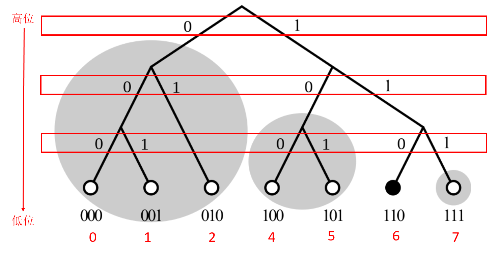
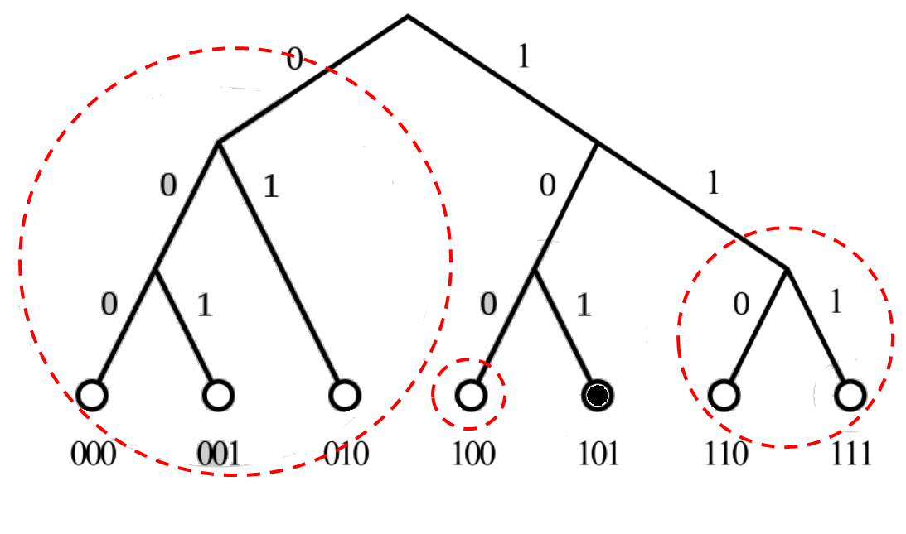
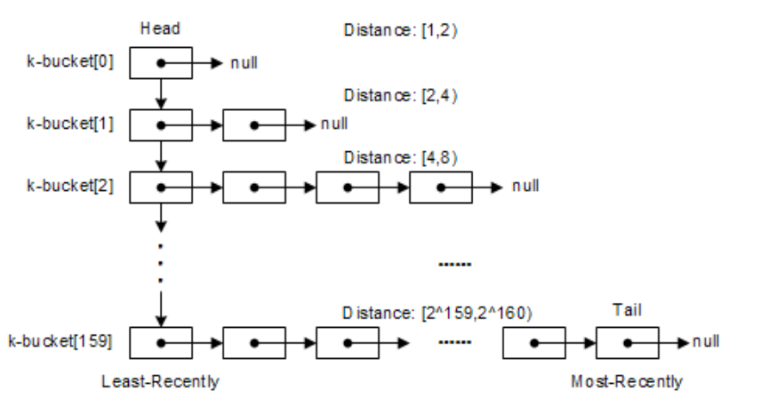
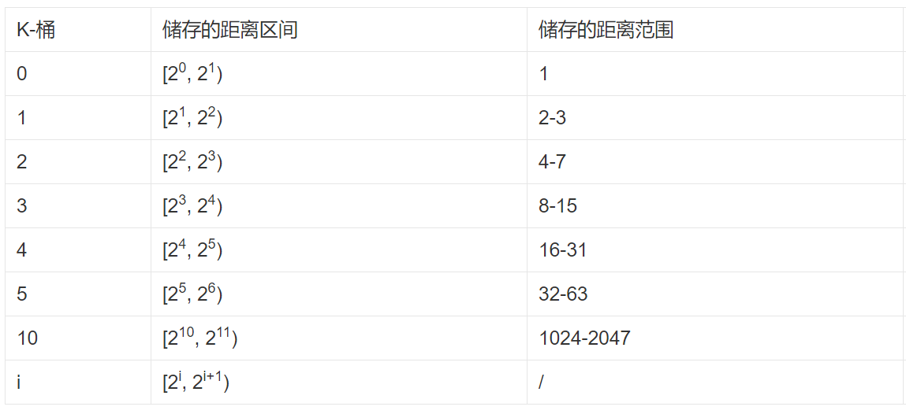

#Kademila算法整理

##节点之间的距离
Kad 网络中每个节点都有一个 160bit 的 ID 值作为标志符，key 也是一个 160bit 的标志符，每一个加入 Kad 网络的节点都会被分配一个 160bit 的节点ID（node ID），这个 ID 值是随机产生的。同时 <key, value> 对的数据就存放在 ID 值距离 key 值最近的若干个节点上。

Kad 算法一个精妙之处在于它采用异或操作来计算节点之间的距离。通过异或操作，我们可以得到该距离算法有一下特点：
- (A ⊕ B)  == (B ⊕ A)：对称性，A到B的距离和B到A的距离是相等的。
- (A ⊕ A) == 0：节点自身与自身的距离是0
- (A ⊕ B) > 0 ：任意两个节点之间的距离一定大于0
- (A ⊕ B) + (B ⊕ C) >= (A ⊕ C)：三角不等，A经过B到C的距离总是大于等于A直接到C的距离
所以，这里所说的距离是逻辑上的距离，与地理位置无关，所以有可能两个节点之间计算得到的逻辑距离很近，但实际上地理上的距离却很远。

例如：节点A的ID（011）和节点B的ID（101）距离：`011 ⊕ 101 = 110 = 4+2 = 6。`

##路由表
###映射规则
- Step1：先把key（如节点ID）以二进制形式表示，然后从高位到地位依次按Step2~Step3处理。
- Step2：二进制的第n位对应二叉树的第n层。
- Step3：如果当前位是1，进入右子树，如果是0则进入左子树（认为设定，可以反过来）。
- Step4：按照高位到地位处理完后，这个Key值就对应于二叉树上的某个叶子节点。

当我们把所有节点ID都按照上述步骤操作后，会发现，这些节点形成一颗二叉树。

###二叉树拆分规则

每一个节点都可以从自己的视角来对二叉树进行拆分。

拆分规则是从根节点开始，把不包含自己的子树拆分出来，然后在剩下的子树再拆分不包含自己的下一层子树，以此类推，直到最后只剩下自己。如上图所示，以节点ID为6（110）为视角进行拆分，可以得到3个子树（灰色圆圈）。而以节点101为视角拆分，则可以得到如下二叉树。

> Kad默认的散列值空间是m=160（散列值有160bit），所以拆分以后的子树最多有160个。

对于每个节点，当按照自己的视角对二叉树进行拆分以后，会得到n个子树。对于每个子树，如果都分别知道里面1个节点，那么就可以利用这n个节点进行递归路由，从而可以达到整个二叉树的任何一个节点。

###K-桶（K-bucket）机制
假设每个节点ID是N bits。每个节点按照自己视角拆分完子树后，一共可以得到N个子树。上面说了，只要知道每个子树里的一个节点就可以实现所有节点的遍历。但是，在实际使用过程中，考虑到健壮性（每个节点可能推出或者宕机），只知道一个节点是不够的，需要之多多几个节点才比较保险。

所以，在Kad论文中旧有一个K-桶（K-bucket）的概念。也就是说，每个节点在完成拆分子树以后，要记录每个子树里面K个节点。这里K是一个系统级常量，由软件系统自己设定（BT下载使用的Kad算法中，K设定为8）。

K桶在这里实际上就是路由表。每个节点按照自己视角拆分完子树后，可以得到N个子树，那么就需要维护N个路由表（对应N个K-桶）。

Kad算法中就使用了K-桶的概念来存储其他邻近节点的状态信息（节点ID、IP和端口），如下图，对于160bit的节点ID，就有160个K-桶，对于每一个K-桶i,它会存储与自己距离在区间[2^i, 2^(i+1)) 范围内的K个节点的信息，如下图所示。每个K-桶i中存储有K个其他节点信息，在BitTorrent中K取8。当然每一个K-桶i不可能把所有相关的节点都存储，这样表根本存储不下。它是距离自己越近的节点存储的越多，离自己越远存储的越少（只取距离自己最近的K个节点），如下图所示。

同时每个K-桶中存放的位置是根据上次看到的时间顺序排列，最早访问的放在头部，最新访问的放在尾部。

###K-桶更新机制
主要有以下3种
- 主动收集节点:任何节点都可以发起FIND_NODE（查询节点）的请求，从而刷新K-桶中的节点信息
- 被动收集节点:当收到其他节点发送过来的请求（如：FIND_NODE、FIND_VALUE），会把对方的节点ID加入到某个K-桶中
- 检测失效节点-通过发起PING请求，判断K-桶中某个节点是否在线，然后清理K-桶中哪些下线的节点

当一个节点ID要被用来更新对应的K-桶，其具体步骤如下：

- 计算自己和目标节点ID的距离d
- 通过距离d选择路由表中对应的K-桶，如果目标节点ID已经在K-桶中，则把对应项移到该K-桶的尾部（为什么是尾部呢？）
- 如果目标节点ID不在K-桶中，则有两种情况：
  - 如果该K-桶存储的节点小于K个，则直接把目标节点插入到K-桶尾部；
  - 如果该K-桶存储节点大于等于K个，则选择K-桶中的头部节点进行PING操作，检测节点是否存活。如果头部节点没有响应，则移除该头部节点，并将目标节点插入到队列尾部；如果头部节点有响应，则把头部节点移到队列尾部，同时忽略目标节点。

我们可以看到K-桶的更新机制实现了一种把最近看到的节点更新的策略，也就是说在线时间长的节点有较高的可能性能够继续保留在K-桶列表中。

这种机制提高了Kad网络的稳定性并降少了网络维护成本（减少构建路由表），同时这种机制能在一定程度上防御DDOS攻击，因为只有老节点失效后，Kad才会更新K-桶，这就避免了通过新节点加入来泛洪路由信息。

##协议消息
Kad算法一共有4中消息类型：
- PING 检查节点是否在线
- STORE 通知一个节点存储<key, value>键值对，以便以后查询使用
- FIND_NODE 返回对方节点桶中离请求键值最近的 K 个节点
- FIND_VALUE 与 FIND_NODE 一样，不过当请求的接收者存有请求者所请求的key值的时候，它将返回相应value
> 备注：每个发起请求的RPC消息都会包含一个发送者加入的随机值，这个可以确保在接收到消息响应的时候可以根前面发送过的消息匹配。

##定位节点
节点查询可以同步进行也可以异步进行，同时查询的并发数量一般为3。

Step1：首先由发起者确定目标ID对应路由表中的K-桶位置，然后从自己的K-桶中筛选出K个距离目标ID最近的节点，并同时向这些节点发起FIND_NODE的查询请求。
Step2：被查询节点收到FIND_NODE请求后，从对应的K-桶中找出自己所知道的最近的K个节点，并返回给发起者。
Step3：发起者在收到这些节点后，更新自己的结果列表，并再次从其中K个距离目标节点ID最近的节点，挑选未发送请求的节点重复Step1步骤。
Step4：上述步骤不断重复，直到无法获取比发起者当前已知的K个节点更接近目标节点ID的活动节点为止。
在查询过程中，没有及时响应的节点应该立即排除，同时查询者必须保证最终获得的K个节点都是在线的。

##定位资源
当节点要查询<key, value>数据对时，和定位节点的过程类似。

- Step1：首先发起者会查找自己是否存储了<key, value>数据对，如果存在则直接返回，否则就返回K个距离key值最近的节点，并向这K个节点ID发起FIND_VALUE请求
- Step2：收到FIND_VALUE请求的节点，首先也是检查自己是否存储了<key, value>数据对，如果有直接返回value，如果没有，则在自己的对应的K-桶中返回K-个距离key值最近的节点
- Step3：发起者如果收到value则结束查询过程，否则发起者在收到这些节点后，更新自己的结果列表，并再次从其中K个距离key值最近的节点，挑选未发送请求的节点再次发起FIND_VALUE请求。
- Step4：上述步骤不断重复，直到获取到value或者无法获取比发起者当前已知的K个节点更接近key值的活动节点为止，这时就表示未找到value值。
如果上述FIND_VALUE最终找到value值，则<key, value>数据对会缓存在没有返回value值的最近节点上，这样下次再查询相同的key值时就可以加快查询速度。

所以，越热门的资源，其缓存的<key, value>数据对范围就越广。这也是为什么我们以前用P2P下载工具，下载的某个资源的人越多时，下载速度越快的原因。

##保存资源
保存资源
当节点收到一个<key, value>的数据时，它的存储过程如下：

- Step1：发起者首先定位K个距离目标key值最近的节点
- Step2：然后发起者对这K个节点发起STORE请求
- Step3：接收到STORE请求的节点将保存<key, value>数据
- Step4：同时，执行STORE操作的K个节点每小时重发布自己所有的<key, value>对数据
- Step5：最后，为了限制失效信息，所有<key, value>对数据在发布24小时后过期。

##加入网络
一个新节点想要加入Kad网络，其步骤如下：

- Step1：新节点A首先需要一个种子节点B作为引导，并把该种子节点加入到对应的K-桶中
- Step2：首先生成一个随机的节点ID值，直到离开网络，该节点会一直使用该ID
- Step3：向节点B发起FIND_NODE请求，请求定位的节点时自己的节点ID
- Step4：节点B在收到节点A的FIND_NODE请求后，会根据FIND_NODE请求的约定，找到K个距离A最近的节点，并返回给A节点
- Step5：A收到这些节点以后，就把它们加入到自己的K-桶中
- Step6：然后节点A会继续向这些刚拿到节点发起FIND_NODE请求，如此往复，直到A建立了足够详细的路由表。
节点A在自我定位建立路由表的同时，也使得其他节点能够使用节点A的ID来更新他们的路由表。这过程让节点A获得详细路由表的同时，也让其他节点知道A节点的加入。
