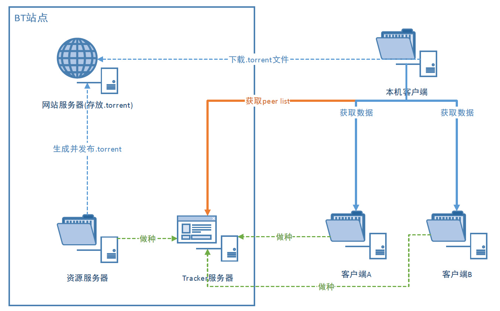

#简述BT下载流程
因为是简述BitTorrent协议，所以不详细的将协议的每个字段都进行说明，只描述一些关键内容。

如果我是漫游的管理员，有一天枫雪字幕组将刚翻译好的“海贼王712集.mkv”发给了我，接下来我需要做些什么才能将资源散步到互联网上呢？

##B encode
在说明网络流程之前，先简单介绍下B encode，因为在BitTorrent协议中的数据几乎都是用B encode进行编码的。它是一种作用类似于XML和JSON的数据组织格式，可以表达字符串、整数两种基本类型，列表、字典两种数据结构，它的语法规则十分简单。

- 字节串按如下方式编码：

 ><以十进制ASCII编码的串长度>：<串数据>   
 例：“4:spam”表示字节串“spam”

- 整数按如下方式编码：

>i<以十进制ASCII编码的整数>e   
例：“i3e”表示整数“3”

- 列表按如下方式编码：

> l<内容>e 开始的“l”与结尾的“e”分别是开始和结束分隔符。lists可以包含任何B编码的类型，包括整数、串、dictionaries和其他的lists。   
例：l4:spam4:eggse 表示含有两个串的lists:[“spam”、“eggs”]

字典按如下方式编码：

>d<内容>e 开始的“d”与结尾的“e”分别是开始和结束分隔符。注意键（key）必须被B编码为串。值可以是任何B编码的类型，包括整数、串、lists和其他的dictionaries。键（key）必须是串，并且以排序的顺序出现（以原始串排列，而不是以字母数字顺序）。   
例1：d3:cow3:moo4:spam4:eggse 表示dictionary { “cow” => “moo”, “spam” => “eggs” }

##元信息文件 .torrent
作为发布者，首先需要有一个域名，一台作为Tracker的服务器，一台发布.torrent文件的服务器，一台保存资源的服务器，当然这些可以共用一台服务器。使用BitTorrent工具选择“海贼王712集.mkv”文件，指定Tracker服务器的URL，会生成一个.torrent文件。

.torrent文件使用B encode表示，整个是一个字典数据结构，它有多个key值，包括一些是可选的，这里介绍最关键的几个键值对。

- info：存储资源文件的元信息
  - piece length
  - pieces
  - name/path
- announce：描述tracker服务器的URL

info键对应的值又是一个字典结构，BT协议将一个文件分成若干片，便于客户端从各个主机下载各个片。其中的piece length键值对表示一个片的长度，通畅情况下是2的n次方，根据文件大小有所权衡，通长越大的文件piece length越大以减少piece的数量，降低数量一方面降低了.torrent保存piece信息的大小，一方面也减少了下载需要对片做的确认操作，加快下载速度。目前通常是256kB,512kB或者1MB。

pieces则是每个piece的正确性验证信息，每一片均对应一个唯一的SHA1散列值，该键对应的值是所有的20字节SHA1散列值连接而成的字符串。

name/path比较笼统的说，就是具体文件的信息。因为BitTorrent协议允许将数个文件和文件夹作为一个BitTorrent下载进行发布，因此下载方可以根据需要勾选某一些下载文件。注意，这里将数个文件也砍成一个数据流，因此一个piece如果在文件边界上，可能包含不同文件的信息。

announce保存的是tracker服务器的URL，也就是客户端拿到.torrent文件首先要访问的服务器，在一些扩展协议中，announce可以保存多个tracker服务器作为备选。

生成好.torrent文件之后，发布者需要先作为下载者一样根据.torrent文件进行下载，这样就会连接到tracker服务器。由于发布者已经有了完整的资源文件，tracker服务器会得知这是一个完全下载完成的用户，会把发布者的信息保存在tracker服务器中，这之间的协议在后面讲客户端和tracker服务器的通信协议的时候再说。

发布者还要做的最后一件事就是将.torrent文件放在服务器上，可以通过HTTP或者FTP协议供用户下载这个.torrent文件。相比于直接将整个资源文件提供给用户下载，只传输一个.torrent文件大大降低了服务器的负荷。

这样，发布者的任务就完成了，只需要在资源传播开前保证资源服务器，也就是保存了资源的文件的服务器在开启状态，能够持续上传直到资源传播开来。

##客户端和Tracker服务器
假设我发现刚刚发布的BT种子资源，我需要怎样才能下载到原始的文件呢？

首先，可以通过HTTP或者FTP协议直接从服务器上得到.torrent文件。然后使用BitTorrent软件客户端打开.torrent文件，软件会根据.torrent的name/path元信息告诉我这个.torrent文件可以下载到一个.mkv文件，一个字幕文件，在这个阶段我可以进行一些勾选，选择下载某些而不是全部的资源。

资源选择确定后，BitTorrent软件客户端就开始了下载。客户端的第一步任务根据.torrent上的URL使用HTTP GET请求，这个请求包含了很多参数，这里只介绍从客户端发送到Tracker的请求最关键的几个参数。

- info_hash
- peer_id
- ip
- port

info_hash是元信息.torrent文件中info键所对应的值的SHA1散列，可以被Tracker服务器用来索引唯一的对应资源。

peer_id是20byte的串，没有任何要求，被Tracker服务器用于记录客户端的名字。

ip可以从HTTP GET请求中直接获取，放在参数中可以解决使用代理进行HTTP GET的情况，Tracker服务器可以记录客户端的IP地址。

port客户端监听的端口号，用于接收response。一般情况下为BitTorrent协议保留的端口号是6881-6889，Tracker服务器会记录下端口号用于通知其他客户端。

在Tracker服务器收到客户端的HTTP GET请求后，会返回B encode形式的text/plain文本，同样是一个字典数据结构，其中最关键的一个键值对是peers，它的值是个字典列表结构，列表中的每一项都是如下的字典结构。

- peers
  - peer_id
  - ip
  - port
这些信息在每个客户端连接Tracker服务器的时候都发送过，并且被Tracker服务器保存了下来。新来的客户端自然要获取到这些下载中或者已下载完的客户端的ip，port等信息，有了这些信息，客户端就不需要像FTP或者HTTP协议一样持续找服务器获取资源，可以从这些其他客户端上请求获取资源。

##peer to peer
peer to peer，简称P2P，就是从其他的下载用户那里获取数据，也就是BitTorrent下载的核心特点。客户端从Tracker服务器获取到若干其他下载者(peer)的ip和port信息，会进行请求并维持跟每一个peer的连接状态。一个客户端和每一个peer的状态主要有下列状态信息：

- choked：远程客户端拒绝响应任何本客户端的请求。
- interested：远程客户端对本客户端的数据感兴趣，当本客户端unchoked远程客户端后，远程客户端会请求数据。

所以应该有4个参数，分别表示本客户端对远程客户端是否chock，是否interested，远程客户端对本客户端是否chock，是否interested。当一个客户端对一个远程peer感兴趣并且那个远程peer没有choke这个客户端，那么这个客户端就可以从远程peer下载块(block)。当一个客户端没有choke一个peer，并且那个peer对这个客户端这个感兴趣时，这个客户端就会上传块(block)。

第一次通信会先发送握手报文，告诉远程客户端本客户端的一些信息，包括info_hash和peer_id。

接下来的所有报文有如下几种类型：

keep-alive：告诉远程客户端这个通信还在维持，否则超过2分钟没有任何报文远程客户端会将通信关闭
- choke
- unchoke
- interested
- not interested
- bitfield：告诉对方我已经有的piece
- have：告诉对方某个piece已经成功下载并且通过hash校验
- request：请求某个块(block)
  - index: 整数，指定从零开始的piece索引
  - begin: 整数，指定piece中从零开始的字节偏移
  - length: 整数，指定请求的长度
- piece：返回请求的块(block)的数据，是真正的资源信息
  - index: 整数，指定从零开始的piece索引
  - begin: 整数，指定piece中从零开始的字节偏移
  - block: 数据块
经过这些报文在本地客户端和若干个远程客户端之间的来回传递，就能够获取到资源文件。

##一些trade-off
经过前面的简单描述，可以看到这种P2P信息传递的有诸多可以进行挖掘和优化的地方。比如每次tracker服务器返回多少个peer，多了无用并且增加网络负荷，少了又不够。客户端同时和多少个peer保持通信最好。客户端应该优先请求哪些piece，如何请求连续的piece能够提高缓存的使用率。为什么下载接近完成最后的一些数据总是非常慢。这些都是值得优化和研究的地方。

##扩展协议：DHT和PT
原始的BitTorrent协议有很多可以扩展进行功能增强的地方，例如tracker服务器瘫痪了是不是BT下载就崩了？是否从其他远程客户端获取其他peer的信息，而不用每次都从tracker服务器获取。又或者有恶意的客户端只下载不上传怎么办，原来迅雷就因为有一些不按照分享精神的特性被称为“吸血雷”。这些问题都有许多人提出了扩展的方案进行解决，社区的存在让这些扩展方案有一部分能够得到标准化的推广，DHT和PT就是比较有代表性的扩展协议。

DHT全称分布式哈希表(Distributed Hash Table)，DHT相关的算法有很多，像Chord, Pastry, Kademlia。这里我们不深入细节只简单说明下DHT的思想。每一个客户端都加入到DHT网络中，当新的客户端加入进来需要某个资源的时候，会根据info_hash去请求DHT网络中的客户端，根据不同的算法实现，其他客户端会帮助该客户端找到拥有此资源的客户端，并提供ip供其进行通信。这是一种完全的“去中心化”的思想。

PT全称Private Tracker，与BT最大的不同点分别为可进行私密范围下载，及可统计每个用户的上载及下载量。从技术上可以简单的看作有一个Tracker服务器会对用户的下载上传进行统计，分享率不够就禁止用户下载，在一定程度上可以防止只下载而不上传的用户存在。PT最大的问题是需要账号导致小众，资源容易断档，有些PT网站会用各种激励的错失尽可能减少文件断档，例如即使没有其他用户在下载，开启BT客户端将资源挂着做种也可以得到一些积分奖励。
